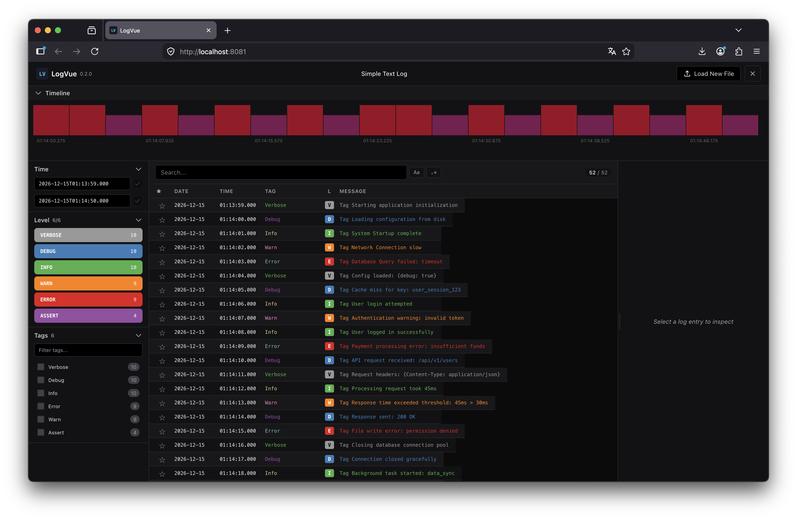

# LogVue

A log viewer application for most known log formats. Features virtual scrolling, filtering, and timeline
visualization.



### Installation

#### macOS

1. Download the appropriate binary:
   - **Apple Silicon (M1/M2/M3)**:
     `curl -L -o logvue https://github.com/yushman/logvue/releases/download/v0.3.0/logvue-darwin-arm64`
   - **Intel Mac**: `curl -L -o logvue https://github.com/yushman/logvue/releases/download/v0.3.0/logvue-darwin-amd64`

2. Remove quarantine attribute (required by macOS):
   ```bash
   /usr/bin/xattr -drs com.apple.quarantine logvue
   ```

3. Make it executable:
   ```bash
   chmod +x logvue
   ```

#### Linux

1. Download the appropriate binary:
   - **x86_64**: `curl -L -o logvue https://github.com/yushman/logvue/releases/download/v0.3.0/logvue-linux-amd64`
   - **ARM64**: `curl -L -o logvue https://github.com/yushman/logvue/releases/download/v0.3.0/logvue-linux-arm64`

2. Make it executable:
   ```bash
   chmod +x logvue
   ```

### Usage

```bash
./logvue start -p 8081              # Start server on port 8081 (default)
./logvue start --tls --domain <domain>  # Start with HTTPS (Let's Encrypt)
./logvue status                     # Check server status
./logvue stop                       # Stop server
```

**Options for `start`:**

- `-p, --port <port>`      HTTP port (default: 8081)
- `--tls`                  Enable HTTPS with Let's Encrypt auto-cert
- `--domain <domain>`       Domain name for Let's Encrypt (required with --tls)
- `--https-port <port>`    HTTPS port (default: 443, requires root)

Then open http://localhost:8081 in your browser.

### License

MIT